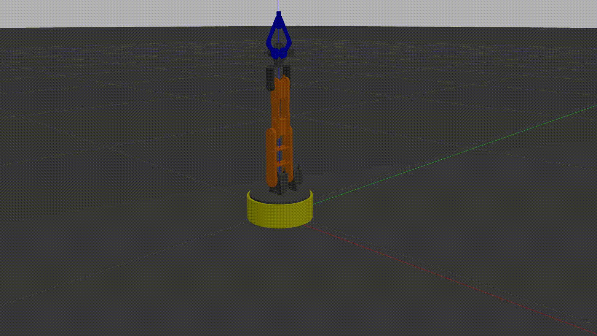

# ROS Gazebo Simulation

Gazebo Simulation on ROS noetic using the [Tu_nguyen robot arm model](https://grabcad.com/library/model-robot-arm-4-dof-and-description-urdf-in-rviz-ros-1) from GrabCad and ROS Control.

## ROS Control

The robot joints in the URDF file were assigned an effort hardware interface. To control the arm robot, two joint trajectory controllers were specified in the config.yaml file and assigned to the joints.

A python script using the **rospy** library will communcate with the trajectory controller through ROS action servers and clients to move the joints over multiple positions in a hard-coded trajectory.

## Demo

### Gazebo Simulation

### Running the simulation

After cloning the repository on an Ubuntu 20 system, make sure to install the ROS Control dependencies.

    sudo apt-get install ros-noetic-ros-control ros-noetic-ros-controllers

Build the catkin workspace.

    sudo catkin build

Source the workspace and run the roslaunch file.

    source <workspace_path>/devel/setup.bash
    roslaunch robot_control control.launch

## Multimove branch

As part of an internship research, a movement approach was designed to control every joint separately and simultaneously by assigning a trajectory controller and an action client to every joint.

For the client side, a state machine containing a concurrent container will ensure the flow of the movement and the activation of the clients based on their dependencies.

When running the roslaunch file, after Gazebo and the controllers are launched, press any key to start.

### Demo

